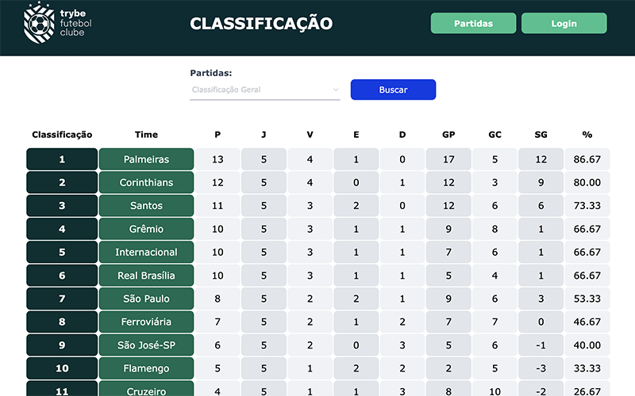

# TFC Football Club

An application to keep track of the Brazilian national football championship.

  - Built with Node, Express, Sequelize, Typescript, React and Docker  
  - 80%+ test coverage with Mocha, ChaiHTTP, and Sinnon
  - Model, Service, Controller and OOP architecture
  
To run locally clone the repository and run the following commands:
<br>

```
$ npm run compose:up
```
<a href="https://tfc-deploy.vercel.app/leaderboard">Demo</a>
<br>
<br>
<a href="https://tfc-deploy.vercel.app/leaderboard"></a>

